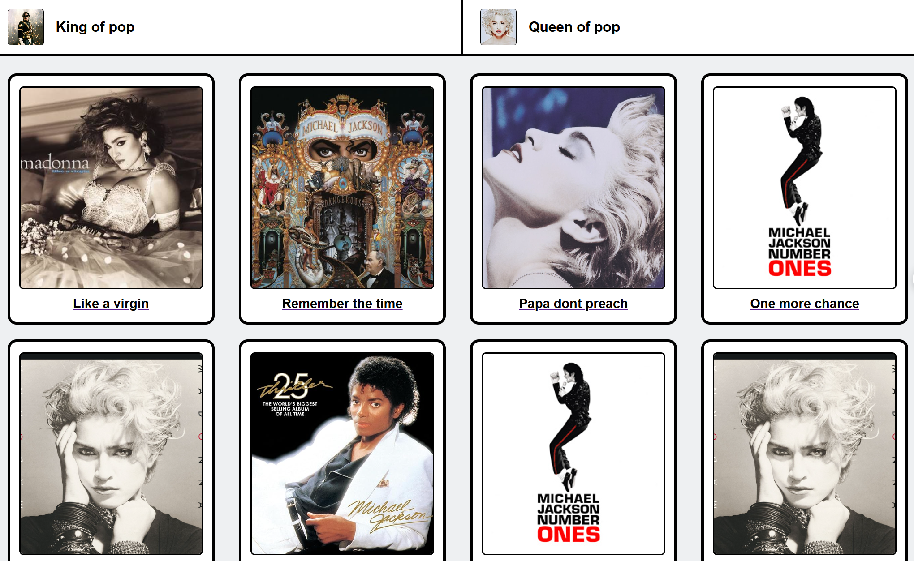
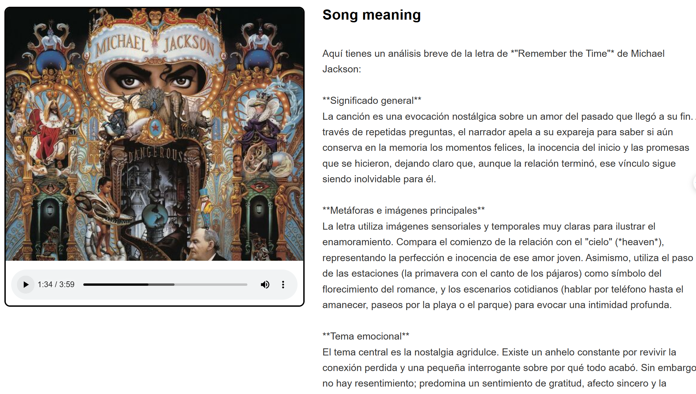

# Sitio Web Pop

Sitio web que integra un LLM (gemini-3.6) para analizar y explicar el significado de una canción pop.

## Ejecución

Basta con tener la extensión Live Server y activarla.

## Capturas

